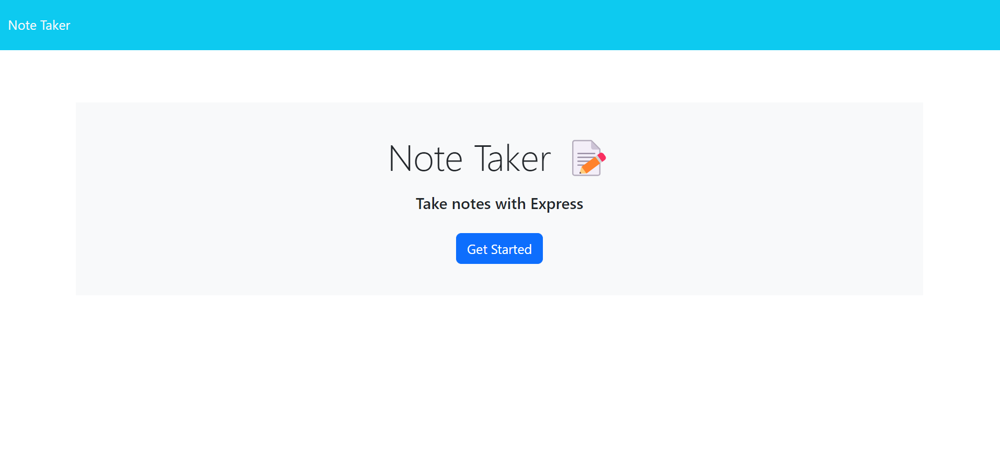
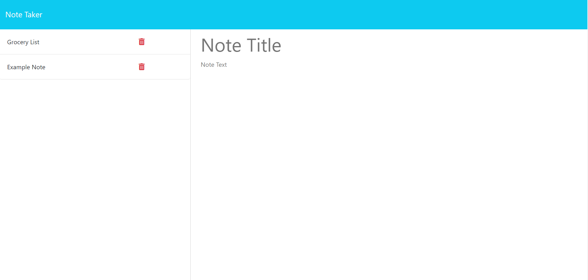

# Express.js Notebook

## Table of Contents
* [Description](#description)
* [Installation](#installation)
* [Usage](#usage)
* [Tests](#tests)
* [Contributing](#contributing)
* [License](#license)
* [Questions](#questions)

## Description
As a small business owner, I want to be able to write and save notes, so that I can organize my thoughts and keep track of tasks I need to complete. I built this project to test my knowledge of node, express.js, and connecting the front-end to the back-end of applications. This project is practical because it is a notebook that can be accessed from anywhere at any time. I learned how to build a back end server during this project and I think that will be very valuable information in my future.

## Installation
No installation is required, simply go to the following link to use the notebook:

[link here]

## Usage
The Express.js Notebook opens up on a landing page. From the landing page you can proceed to the notes page by clicking "Get Started".

Once on the notes page you can write, save, and delete notes as you please. You can also view saved notes by clicking on them in the left column.

## Tests
Testing was performed by trial and error.

## Contributing
Andria Goodwin with starter code provided by the KU ed-X coding bootcamp.

## License
This project is covered under the MIT license. To learn more about what this means, click the license button at the top.

## Questions
If you have any questions, please feel free to reach me at andria.goodwin1@gmail.com or visit my GitHub profile @ https://github.com/andria-goodwin